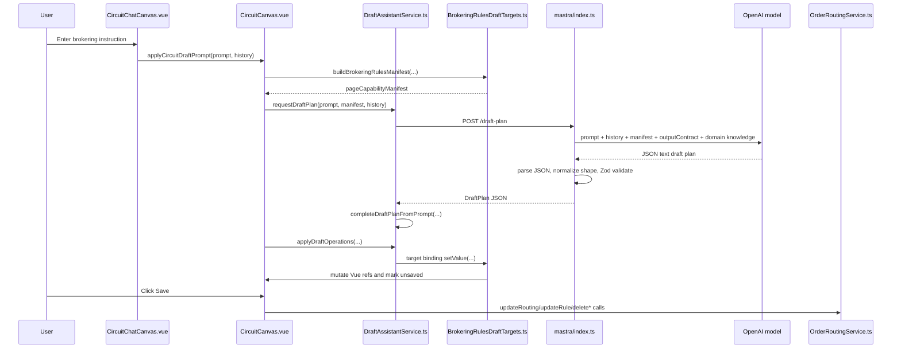

# Brokering Agent UI Contract

This document explains how the brokering agent UI turns a natural-language prompt into draft UI changes, what JSON moves between the PWA and Mastra, where output is validated, and which code actually updates the brokering rule state.

## Short Answer

The agent is a draft-only assistant. Mastra does not update HotWax data directly, call the Order Routing API, or control the browser. It returns a JSON draft plan. The PWA validates that plan against a page capability manifest and applies only supported operations to local Vue draft state. The backend is updated later only when the user clicks Save in the brokering UI.

The legacy `/draft-plan` implementation uses a structured JSON contract enforced after generation by Zod and PWA validation. The newer `/brokering-route-draft` implementation uses Mastra structured output with a Zod schema, so Mastra receives the brokering-route schema as the `structuredOutput.schema` parameter and exposes the validated domain object on `result.object`.

## Runtime Flow



## Where The Pieces Live

| Concern | File | Main functions |
| --- | --- | --- |
| Mastra route and agent prompt | `mastra/index.ts` | `draftAgent`, `POST /draft-plan`, `parseJsonObject`, `normalizeDraftPlan` |
| Mastra request/response schema | `mastra/draftPlanSchema.ts` | `draftPlanRequestSchema`, `draftPlanSchema`, `pageCapabilityManifestSchema` |
| Brokering domain structured-output schema | `mastra/brokeringRouteDraftSchema.ts` | `brokeringRouteDraftSchema`, `brokeringRouteDraftRequestSchema`, `normalizeBrokeringRouteDraft` |
| Domain context retrieval | `mastra/orderRoutingDomainKnowledge.ts` | `requireOrderRoutingDomainKnowledge`, `getOrderRoutingDomainKnowledge` |
| Generic PWA draft assistant service | `src/services/DraftAssistantService.ts` | `requestDraftPlan`, `completeDraftPlanFromPrompt`, `validateDraftOperations`, `applyDraftOperations` |
| Brokering page capability manifest and bindings | `src/draftTargets/BrokeringRulesDraftTargets.ts` | `buildBrokeringRulesManifest`, `buildBrokeringRulesBindings`, `applyBrokeringRulesOperation` |
| Chat entry point | `src/components/circuit/CircuitChatCanvas.vue` | `onSend`, `buildConversationHistory` |
| Brokering canvas and save flow | `src/components/circuit/CircuitCanvas.vue` | `applyCircuitDraftPrompt`, `buildCircuitDraftManifest`, `save` |
| Backend API service | `src/services/RoutingService.ts` | `updateRouting`, `updateRule`, `deleteRoutingFilter`, `deleteRuleCondition`, `deleteRuleAction` |

## How Mastra Decides What To Output

Mastra's draft agent is constrained by four inputs:

1. The user's latest prompt.
2. Recent conversation history, normalized by the PWA and sent as `conversationHistory`.
3. A page capability manifest generated by the PWA from the currently visible brokering route/rule state.
4. A selected excerpt from `mastra/public/knowledge/hotwax_order_routing_domain_knowledge.yaml`.

The manifest is the hard authority. The prompt in `mastra/index.ts` tells the model to use only target paths from `pageCapabilityManifest.editableTargets`, use only operation names from the output contract, use option IDs exactly as supplied by the manifest, and ask unanswered questions when a value or target is ambiguous, disabled, or missing.

The domain knowledge is advisory only. It helps map merchant phrasing like "protect stores" or "all brokering locations except warehouses" into order-routing concepts, but it cannot override the manifest's editable targets, valid option IDs, disabled state, or output contract.

The model is expected to return exactly one JSON object:

```json
{
  "operations": [
    {
      "op": "set",
      "target": "selectedRule.inventorySorts.PROXIMITY",
      "value": true,
      "reason": {
        "kind": "explicit_user_request",
        "promptText": "sort by proximity",
        "explanation": "The user asked to sort facilities by proximity."
      }
    }
  ],
  "unansweredQuestions": [],
  "summary": "Applied draft changes"
}
```

## Are We Using Structured Output?

There are now two paths.

The legacy `/draft-plan` route still asks the model for JSON text, extracts/parses it, and validates it with `draftPlanSchema`. That path exists to keep the current UI consumer stable.

The new `/brokering-route-draft` route uses Mastra structured output:

```ts
const result = await agent.generate(messages, {
  structuredOutput: {
    schema: brokeringRouteDraftSchema,
    errorStrategy: "strict"
  }
});

const providerDraft = brokeringRouteDraftSchema.parse(result.object);
```

That route produces a domain-level brokering route draft instead of UI operations.

Current enforcement layers:

1. `mastra/index.ts`: uses `brokeringRouteDraftSchema` as Mastra structured output for `/brokering-route-draft`, and still validates `result.object` with Zod before returning it.
2. `src/services/DraftAssistantService.ts`: filters operations to explicit user intent or allowed manifest dependencies, adds deterministic completions for known brokering phrases, normalizes values, rejects unknown targets, rejects disabled targets, rejects unsupported operations, and resolves option aliases to option IDs.
3. `src/draftTargets/BrokeringRulesDraftTargets.ts`: applies only registered target bindings and mutates only the local draft refs for those targets.

## Brokering Route Draft Schema

The new structured object is:

```ts
type BrokeringRouteDraft = {
  schemaVersion: "brokering-route-draft.v1";
  applyMode: "merge" | "replace";
  route: {
    statusId: "ROUTING_DRAFT" | "ROUTING_ACTIVE" | "ROUTING_ARCHIVED";
    orderSelection: {
      filters: {
        queues: OptionSelection;
        shippingMethods: OptionSelection;
        priorities: OptionSelection;
        promiseDateDays: { max: number | null; excludeMax: number | null };
        salesChannels: OptionSelection;
        originFacilityGroups: OptionSelection;
      };
      sorts: Array<{
        field: "shipByDate" | "shipAfterDate" | "orderDate" | "shippingMethod" | "priority";
        direction: "asc" | "desc";
      }>;
    };
    inventoryRules: Array<{
      ruleKey: string;
      name: string;
      statusId: "RULE_DRAFT" | "RULE_ACTIVE" | "RULE_ARCHIVED";
      sequence: number;
      inventorySelection: {
        filters: {
          facilityGroups: OptionSelection;
          proximity: { maxDistance: number | null; unit: "METRIC" | "IMPERIAL" | null };
          safetyStock: { minimum: number | null };
          facilityOrderLimit: "respect" | "bypass" | "unchanged";
          shipmentThreshold: number | null;
        };
        sorts: Array<{
          field: "proximity" | "inventoryBalance" | "customerSequence";
          direction: "asc" | "desc";
        }>;
      };
      allocation: {
        partialOrderAllocation: boolean;
        partialGroupedItemAllocation: boolean;
      };
      unavailableItems: {
        action: "nextRule" | "moveToQueue";
        queueId: string | null;
        autoCancel: { mode: "none" | "clear" | "days"; days: number | null };
      };
    }>;
  };
  questions: string[];
  summary: string;
};

type OptionSelection = {
  include: string[];
  exclude: string[];
};
```

## PWA To Mastra Request JSON

The PWA sends this request from `requestDraftPlan(...)`:

```json
{
  "prompt": "Use all brokering locations except warehouses and sort by closest facility",
  "conversationHistory": [
    {
      "role": "user",
      "content": "Route unavailable items to the brokering queue"
    },
    {
      "role": "assistant",
      "content": "Which queue should be used?"
    }
  ],
  "pageCapabilityManifest": {
    "pageId": "order-routing.rules",
    "route": "/tabs/circuit",
    "visibleEntities": {},
    "editableTargets": [],
    "outputContract": {
      "operations": ["set"],
      "operationShape": {},
      "responseShape": {}
    }
  },
  "outputContract": {
    "operations": ["set"],
    "operationShape": {},
    "responseShape": {}
  }
}
```

The TypeScript/Zod shape is:

```ts
type DraftPlanRequest = {
  prompt: string;
  conversationHistory?: Array<{
    role: "user" | "assistant";
    content: string;
  }>;
  pageCapabilityManifest: PageCapabilityManifest;
  outputContract?: Record<string, unknown>;
};
```

## Page Capability Manifest Schema

The page capability manifest is the PWA's contract with Mastra. It tells the LLM what the page currently shows and what it is allowed to draft.

```ts
type PageCapabilityManifest = {
  pageId: string;
  route: string;
  visibleEntities: Record<string, unknown>;
  editableTargets: DraftTargetCapability[];
  outputContract: {
    operations: Array<"set">;
    operationShape: Record<string, string>;
    responseShape: Record<string, string>;
  };
};

type DraftTargetCapability = {
  target: string;
  label: string;
  description?: string;
  aliases?: string[];
  entity?: string;
  valueType: "string" | "number" | "boolean" | "enum" | "string[]";
  currentValue?: string | number | boolean | string[];
  options?: DraftOption[];
  multiple?: boolean;
  editable: boolean;
  disabled?: boolean;
  disabledReason?: string;
  staticDisabled?: boolean;
  dependencies?: Array<{
    target: string;
    values: Array<string | number | boolean | string[]>;
    description?: string;
  }>;
};

type DraftOption = {
  id: string;
  label: string;
  description?: string;
  aliases?: string[];
  disabled?: boolean;
  disabledReason?: string;
};
```

For brokering rules, `buildBrokeringRulesManifest(...)` currently exposes targets like:

```text
route.statusId
selectedRule.statusId
route.orderFilters.QUEUE
route.orderFilters.QUEUE_EXCLUDED
route.orderFilters.SHIPPING_METHOD
route.orderFilters.SHIPPING_METHOD_EXCLUDED
route.orderFilters.PRIORITY
route.orderFilters.PRIORITY_EXCLUDED
route.orderFilters.PROMISE_DATE
route.orderFilters.PROMISE_DATE_EXCLUDED
route.orderFilters.SALES_CHANNEL
route.orderFilters.SALES_CHANNEL_EXCLUDED
route.orderFilters.ORIGIN_FACILITY_GROUP
route.orderFilters.ORIGIN_FACILITY_GROUP_EXCLUDED
route.orderSorts.SHIP_BY
route.orderSorts.SHIP_AFTER
route.orderSorts.ORDER_DATE
route.orderSorts.SHIPPING_METHOD_SORT
route.orderSorts.SORT_PRIORITY
selectedRule.inventoryFilters.FACILITY_GROUP
selectedRule.inventoryFilters.FACILITY_GROUP_EXCLUDED
selectedRule.inventoryFilters.PROXIMITY
selectedRule.inventoryFilters.MEASUREMENT_SYSTEM
selectedRule.inventoryFilters.BRK_SAFETY_STOCK
selectedRule.inventoryFilters.FACILITY_ORDER_LIMIT
selectedRule.inventoryFilters.SHIP_THRESHOLD
selectedRule.inventorySorts.PROXIMITY
selectedRule.inventorySorts.INV_BALANCE
selectedRule.inventorySorts.CUSTOMER_SEQ
selectedRule.partialAllocation
selectedRule.partialGroupItemsAllocation
selectedRule.unavailableItemsAction
selectedRule.unavailableItemsQueueId
selectedRule.clearAutoCancelDays
selectedRule.autoCancelDays
```

The manifest also includes current visible state:

```ts
visibleEntities: {
  route: {
    orderRoutingId,
    routingName,
    statusId,
    activeOrderFilterTargets,
    activeOrderSortTargets,
    availableInventoryRules,
    draftLimitations: {
      selectedRuleOnly: false,
      canCreateInventoryRules: true,
      canRenameInventoryRules: false
    }
  },
  selectedRule: {
    routingRuleId,
    ruleName,
    statusId,
    assignmentEnumId,
    activeInventoryFilterTargets,
    activeInventorySortTargets,
    activeActionIds
  }
}
```

## Mastra Response Schema

Mastra returns a `DraftPlan`:

```ts
type DraftPlan = {
  operations: DraftOperation[];
  unansweredQuestions: string[];
  summary: string;
};

type DraftOperation = {
  op: "set";
  target: string;
  value: string | number | boolean | string[];
  ruleKey?: string;
  ruleName?: string;
  ruleSequence?: number;
  reason: DraftOperationReason;
};

type DraftOperationReason =
  | {
      kind: "explicit_user_request";
      promptText: string;
      explanation: string;
      dependencyTarget?: string;
    }
  | {
      kind: "manifest_dependency";
      promptText: string;
      explanation: string;
      dependencyTarget: string;
    };
```

Important rules:

- Only `set` is currently supported.
- Every operation must include a reason.
- `explicit_user_request.promptText` must match wording from the latest prompt.
- `manifest_dependency` is allowed only when the target being changed is a declared dependency of another explicitly requested target.
- Unknown targets, unsupported operations, disabled controls, ambiguous options, and invalid values become unanswered questions instead of updates.

## PWA Normalization Service

The generic PWA service is `src/services/DraftAssistantService.ts`.

`requestBrokeringRouteDraftOperations(prompt, manifest, options)` sends the request to `${VUE_APP_MASTRA_URL || "http://localhost:4111"}/brokering-route-draft`, receives the validated brokering-route domain draft, and converts each `route.inventoryRules[]` entry into rule-scoped draft operations.

`completeDraftPlanFromPrompt(...)` is the first PWA-side cleanup pass. It filters operations to the user's explicit prompt and valid manifest dependencies. It also adds deterministic brokering operations that the LLM may miss, including:

- `selectedRule.inventoryFilters.FACILITY_GROUP_EXCLUDED` for phrases like "all brokering locations except warehouses".
- `selectedRule.partialGroupItemsAllocation` plus its `selectedRule.partialAllocation` dependency for grouped-item partial allocation prompts.

`validateDraftOperations(...)` is the main page-aware normalization pass. It:

- Confirms the operation is supported by the manifest output contract.
- Confirms the target exists in `editableTargets`.
- Rejects non-editable or disabled targets.
- Checks declared dependencies.
- Converts booleans, numbers, strings, and string arrays.
- Resolves option labels and aliases back to canonical option IDs.
- Rejects ambiguous option aliases with concrete choices.

`applyDraftOperations(...)` runs validation and then delegates each valid operation to the registered local target binding.

## Service That Actually Updates The UI Draft

The brokering-specific update service is `src/draftTargets/BrokeringRulesDraftTargets.ts`.

`buildBrokeringRulesBindings(...)` registers one binding per supported target. Each binding calls:

```ts
applyBrokeringRulesOperation({ ...operation, op: "set", target, value }, draft)
```

`applyBrokeringRulesOperation(...)` mutates the local Vue refs that back the brokering canvas:

- `routingStatus`
- `selectedRoutingRule`
- `orderRoutingFilterOptions`
- `orderRoutingSortOptions`
- `inventoryRuleFilterOptions`
- `inventoryRuleSortOptions`
- `inventoryRuleActions`
- `inventoryRules`
- `rulesInformation`
- `ruleActionType`

When an operation carries `ruleKey`, the binding first flushes the currently open rule into `rulesInformation`, loads or creates the requested rule in local UI state, applies the operation to that rule, and then restores the previously open rule. `ruleKey` values matching existing `routingRuleId`s edit existing rules. `new:*` or `draft:*` values create local-only inventory rules.

After a successful local operation, the binding sets:

```ts
draft.hasUnsavedChanges.value = true;
refreshDraftRefs(draft);
```

That is why the UI changes before a backend save, and why the Save button becomes enabled. This is still draft state only.

## Service That Persists The Update

The backend update happens only in `save()` inside `src/components/circuit/CircuitCanvas.vue`.

That save function first persists any local-only `new:*` or `draft:*` inventory rules through `createRoutingRule`, rewrites their temporary IDs in local state, and then diffs every edited rule against the original route/rule state. It then dispatches Vuex actions such as:

- `orderRouting/deleteRoutingFilters`
- `orderRouting/updateRouting`
- `orderRouting/createRoutingRule`
- `orderRouting/deleteRuleConditions`
- `orderRouting/deleteRuleActions`
- `orderRouting/updateRule`

Those Vuex actions call `src/services/RoutingService.ts`, which makes HTTP calls to the Order Routing API:

- `POST routings/{orderRoutingId}` through `updateRouting(...)`
- `POST rules/{routingRuleId}` through `updateRule(...)`
- `DELETE routings/{orderRoutingId}/orderFilters` through `deleteRoutingFilter(...)`
- `DELETE rules/{routingRuleId}/inventoryFilters` through `deleteRuleCondition(...)`
- `DELETE rules/{routingRuleId}/actions` through `deleteRuleAction(...)`

The API base comes from `src/api/index.ts`, which resolves the active instance URL to `/rest/s1/order-routing/`.

## Concrete Example

Prompt:

```text
Use all brokering locations except warehouses, sort by proximity, and move unavailable items to the unfillable queue.
```

Likely Mastra/PWA draft plan after normalization:

```json
{
  "operations": [
    {
      "op": "set",
      "target": "selectedRule.inventoryFilters.FACILITY_GROUP_EXCLUDED",
      "value": "WAREHOUSES",
      "reason": {
        "kind": "explicit_user_request",
        "promptText": "all brokering locations except warehouses",
        "explanation": "User requested all brokering locations except this facility group."
      }
    },
    {
      "op": "set",
      "target": "selectedRule.inventorySorts.PROXIMITY",
      "value": true,
      "reason": {
        "kind": "explicit_user_request",
        "promptText": "sort by proximity",
        "explanation": "The user asked to sort eligible facilities by proximity."
      }
    },
    {
      "op": "set",
      "target": "selectedRule.unavailableItemsAction",
      "value": "ORA_MV_TO_QUEUE",
      "reason": {
        "kind": "manifest_dependency",
        "promptText": "move unavailable items to the unfillable queue",
        "explanation": "A queue must be selected through the queue action.",
        "dependencyTarget": "selectedRule.unavailableItemsQueueId"
      }
    },
    {
      "op": "set",
      "target": "selectedRule.unavailableItemsQueueId",
      "value": "UNFILLABLE_PARKING",
      "reason": {
        "kind": "explicit_user_request",
        "promptText": "unfillable queue",
        "explanation": "The user asked to move unavailable items to the unfillable queue."
      }
    }
  ],
  "unansweredQuestions": [],
  "summary": "Drafted excluded warehouse locations, proximity sorting, and unavailable-item queue handling."
}
```

The `WAREHOUSES` and `UNFILLABLE_PARKING` values above are illustrative option IDs. Exact option IDs are not invented by Mastra. They must come from the page manifest options generated from the current store/reference data.

## Current Boundary

The brokering agent UI can draft changes for the selected route, update multiple inventory rules in one proposal, and create new local draft inventory rules. It still cannot make direct REST calls, run brokering, or save changes by itself. The user remains in control of persistence through the normal Save flow.
